<div align="center">

[](https://github.com/lukeswitz/oui-spy-unified-blue/releases)
[](https://testflight.apple.com/join/5RCKgnJ2)


[](https://github.com/lukeswitz/oui-spy-unified-blue/actions/workflows/github-code-scanning/codeql)

# OUI-APEX

<b>OUI-APEX detects surveillance hardware, trackers, drones and other devices and suspicious activity on the 2.4 and 5GHz bands.</b>
<p>Also a solid wardriving and recon app with support for external USB devices. Meshtastic & ATAK integration.</p>

<a href="#get-started"><b>Get started</b></a> &middot; <a href="#using-the-app"><b>Using the app</b></a> &middot; <a href="#what-it-detects"><b>What it detects</b></a> &middot; <a href="#hardware"><b>Hardware</b></a> &middot; <a href="#mesh"><b>Mesh</b></a> &middot; <a href="#privacy"><b>Privacy</b></a>

<table>
  <tr>
    <td width="50%" valign="top">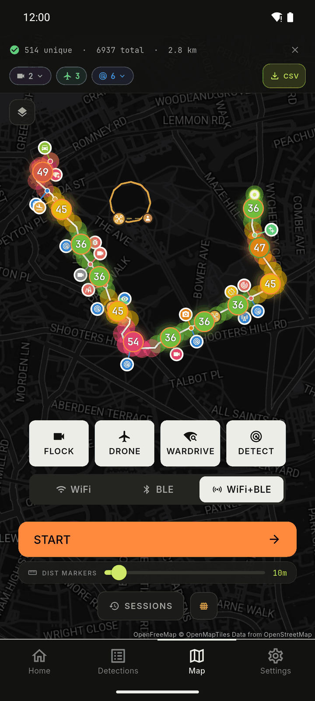</td>
    <td width="50%" valign="top"></td>
  </tr>
</table>

</div>

> Runs the OUI-SPY ecosystem by colonelpanichacks, with additional features.
>
> Beta, possible unexpected behavior. *Not affiliated with OUI-SPY*

OUI-APEX has two parts. Firmware runs on small ESP32 boards and does the scanning. A phone app for Android, iPhone and macOS controls the boards, shows what they find on a list and a map, and uploads wardrives to WiGLE and WDGWars. The phone can also scan by itself, with less detail.

## Contents

1. [What you need](#what-you-need)
2. [Get started](#get-started)
3. [Using the app](#using-the-app)
4. [What it detects](#what-it-detects)
5. [Alerts and watches](#alerts-and-watches)
6. [Map and drones](#map-and-drones)
7. [Captures and special receivers](#captures-and-special-receivers)
8. [Hardware](#hardware)
9. [Mesh](#mesh)
10. [Connect to other tools](#connect-to-other-tools)
11. [Updates](#updates)
12. [Privacy](#privacy)
13. [Internet services](#internet-services)
14. [Build](#build) · [Credits](#credits) · [Disclaimer](#disclaimer)

## What you need

You need the app and, for full detection, at least one ESP32 board. The first table shows what the phone does by itself. The second shows each way to run OUI-APEX.

| | Android | iPhone / macOS |
|---|---|---|
| Phone scans | Bluetooth, Wi-Fi | Bluetooth |
| Detects on its own (no board) | Wi-Fi networks and Bluetooth devices. Drones that send Remote ID over Bluetooth or Wi-Fi / Wi-Fi Aware | Bluetooth devices, no drones |
| Full-feature hardware | ESP32 board(s), RTL-SDR, USB Wi-Fi adapter | ESP32 board(s) |

| Setup | What you need | What you get |
|---|---|---|
| **Phone only** | The app, with **Use this device** on | Wardrive, classify, alert and foxhunt with the phone's own radios. Android also detects drones by Remote ID. |
| **App + board** | The app connected to one ESP32 board over Bluetooth | The board runs the engines. The app controls it, shows the feed and map, adds phone GPS, and saves PCAPs. |
| **Mesh** | One manager board connected to the phone, and up to 6 node boards up to about 200 m away | The manager collects every node's hits, and settings from the app reach all nodes. See [Mesh](#mesh). |
| **Phone + USB radios** | Android, with an RTL-SDR and/or a USB Wi-Fi adapter plugged in | The SDR decodes 315 / 433 / 915 MHz devices and ADS-B aircraft. A USB Wi-Fi adapter scans Wi-Fi, and the MT7921AU also scans Bluetooth LE. Both run alongside the phone's radios. |
| **Standalone** | A board with a screen and buttons, and no phone | You start engines from the buttons. T-Dongles log to microSD. M5Sticks beep and show hits on screen. See [Standalone controls](#standalone-controls). |

[Hardware](#hardware) lists every supported board and USB radio.

## Get started

Setup takes four steps: flash a board, install the app, give it permissions, then connect your hardware.

1. **Flash a board** from the [web flasher](https://lukeswitz.github.io/oui-spy-unified-blue/) in Chrome or Edge over USB. Pick your board's **(node)** entry, or its **(manager)** entry for the one board your phone connects to in a mesh. Later updates come from the app.
2. **Install the app:** [Android / macOS](https://github.com/lukeswitz/oui-spy-unified-blue/releases/latest) or [iOS / macOS TestFlight](https://testflight.apple.com/join/5RCKgnJ2). On macOS, Gatekeeper blocks the first launch of the release zip because it is not notarized. [TestFlight](https://testflight.apple.com/join/5RCKgnJ2) builds are.
3. **Open the app** and go through the permission steps. On Android, set Location to **Allow all the time**, or scanning stops when the screen is off.
4. **Connect your hardware** as described in [Connect your hardware](#connect-your-hardware).

> [!IMPORTANT]
> **Turn off Android's Wi-Fi scan limit.** Android allows four Wi-Fi scans every two minutes and fails the rest.
>
> 1. **Settings → About phone**: tap **Build number** seven times to turn on Developer options.
> 2. **Settings → System → Developer options → Networking**: turn off **Wi-Fi scan throttling**.
>
> Menu paths vary by phone. USB Wi-Fi adapters are not limited.

### First launch

The app asks for each permission on its own screen, then opens Home. The screens in this README are the app itself on Android, filled with made-up devices along a made-up drive through Greenwich, London. The numbers on each screen match its key.

<table>
  <tr>
    <td width="50%" valign="top">
      <ol>
        <li><b>Progress</b>: which permission step you are on. Android asks for five.</li>
        <li><b>Continue</b>: your phone shows its own prompt next.</li>
      </ol></td>
    <td width="50%" valign="top">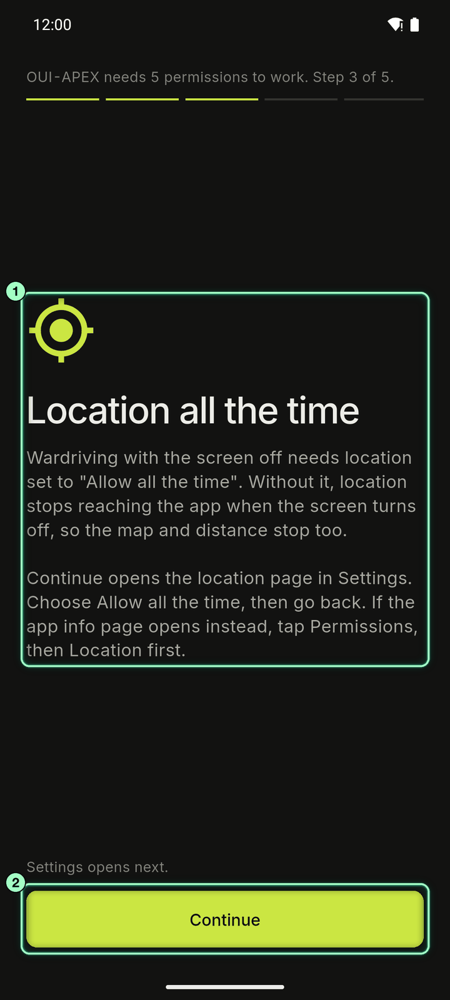
      <ol>
        <li><b>Location all the time</b>: needed to keep wardriving with the screen off.</li>
        <li><b>Continue</b>: opens Settings. Choose <b>Allow all the time</b>, then go back.</li>
      </ol></td>
  </tr>
</table>

<table>
  <tr>
    <td width="50%" valign="top">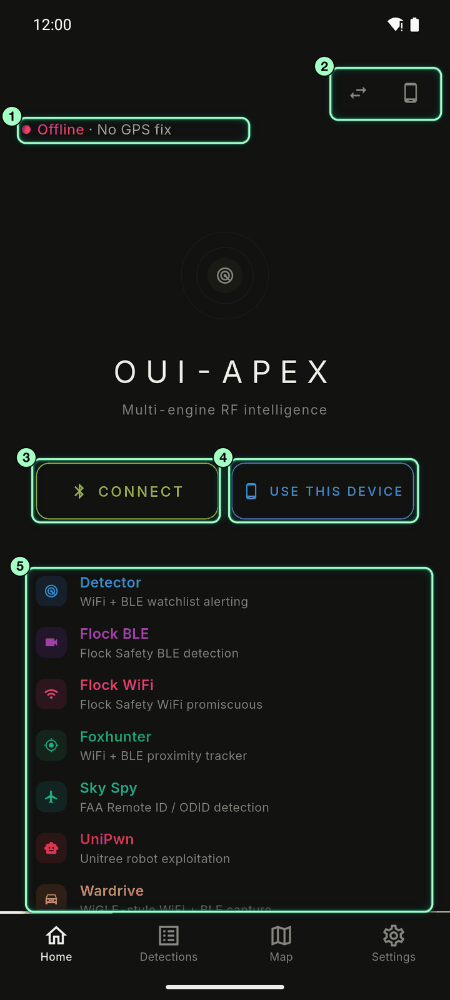
      <ol>
        <li><b>Status</b>: board link and GPS fix.</li>
        <li><b>Shortcuts</b>: the arrows open the Connect screen. The phone icon starts the phone scan.</li>
        <li><b>Use this device</b>: scan with the phone's own radios, no board needed.</li>
      </ol></td>
    <td width="50%" valign="top">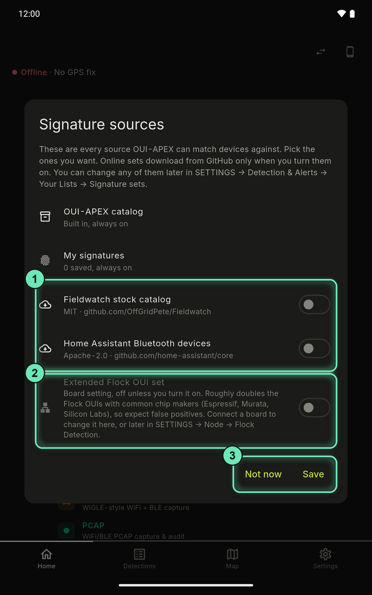
      <ol>
        <li><b>Online sets</b>: the Fieldwatch stock catalog and Home Assistant's Bluetooth device list. They download from GitHub only when you turn them on.</li>
        <li><b>Extended Flock OUI set</b>: a board setting, off by default. It roughly doubles the Flock maker prefixes and gives more false positives. Connect a board to change it.</li>
        <li><b>Save / Not now</b>: the prompt shows once per app version. Change these later in Settings → Detection & Alerts → Your Lists → Signature sets.</li>
      </ol></td>
  </tr>
</table>

### Connect your hardware

After the permission steps, connect your board and any other radios you have.

| Hardware | How to connect it |
|---|---|
| **ESP32 board** | Flash it, power it, then tap **Connect** on Home and pick it. Enter the PIN `123456`. The app then asks you to set your own. A board with no paired phone accepts any phone. Once paired, it accepts a new phone only in the 2 minutes after it powers on. |
| **More boards (mesh)** | Flash one board with a manager target (`mgr-…`) and up to 6 others with node targets (`node-…`). Connect the phone to the manager. The nodes join it on their own within about 10 seconds. See [Mesh](#mesh). |
| **USB Wi-Fi adapter or RTL-SDR** (Android) | Plug it into the phone. When Android asks which app should use it, pick OUI-APEX and tick **Use by default for this USB device**. A Wi-Fi adapter needs internet the first time to download its chip's firmware. See [USB radios on Android](#usb-radios-on-android). |
| **Meshtastic radio** | Close the Meshtastic app, then go to Settings → Data → **Meshtastic radio** → **Find a radio** and pick yours. Then pick one of its private channels. See [Meshtastic radio](#meshtastic-radio). |

Once a board is paired, it keeps the link private and reconnects by itself:

- **Private Bluetooth link:** after pairing, the board hides its name, changes its address every 5–15 min and refuses unknown phones. The paired phone reconnects on its own.
- **Change the PIN** in Settings → Node → Firmware → **Bluetooth PIN**.
- **Pair another phone:** restart the board. It accepts one new phone in the 2 min after power-on. After updating an S3, C3 or older ESP32 board, forget it in your phone's Bluetooth settings and pair again.
- **Forget a paired board:** hold it on the Connect screen.
- **Rename a board:** tap the pencil next to it on the Connect screen after its first connection.

## Using the app

The app has four main screens, reached from the tabs at the bottom.

- **Home:** the session bar (targets, radio, Start / Pause / Stop) and one card per engine. The status bar shows the link, GPS fix and node count.
- **Detections:** Live lists every hit with filter, sort, search and export. Devices lists classified devices. Alerts lists every alert and every saved Flock, Detector, drone and SDR hit, newest first, with CSV export.
- **Map:** choose targets (WiGLE / Flock / Drone / Detector) and radio (Wi-Fi / BLE / both), then tap Start. Sessions save as WiGLE CSV, upload to [WiGLE](https://wigle.net) and [WDGWars](https://wdgwars.pl), and replay on the map.
- **Settings:** six menus, each with its own pages.
  - **App**
  - **Scanning**
    - [Timing & Re-log](#scan-timing-and-channels)
    - [Channels & Band](#scan-timing-and-channels)
    - [External Adapters](#usb-radios-on-android)
  - **Detection & Alerts**
    - [What to Watch For](#choose-what-alerts-you)
    - [Notifications](#sounds-and-muting)
    - [Your Lists](#watchlist)
    - [This Phone](#watches)
    - [Privacy](#receive-only)
  - **Node**
    - [Sound & Lights](#sounds-and-muting)
    - [GPS Source](#optional-gps-module)
    - [Flock Detection](#what-it-detects)
    - [Radio Privacy](#other-privacy-settings)
    - [Offline Scan](#offline-scan-and-the-jcmk-node-hub)
    - [Mesh](#mesh)
    - [Firmware](#firmware-updates)
    - [JCMK Node Hub](#offline-scan-and-the-jcmk-node-hub)
  - **Data**
    - [Accounts](#accounts-and-capture-database)
    - [Capture Database](#accounts-and-capture-database)
    - [Captures](#packet-capture)
    - [Export](#connect-to-other-tools)
    - [Meshtastic radio](#meshtastic-radio)
    - [Triangulation](#map-tools)
    - [Assistant](#assistant)
  - **[About](#app-updates)**

The sections below follow a typical session: start a scan, watch detections come in, read alerts, check the map, then review the saved session.

### Start a scan

Pick what to look for and which radios to use, then tap Start.

<table>
  <tr>
    <td width="50%" valign="top">
      <ol>
        <li><b>Counters</b>: unique devices, engines running, and hits per minute.</li>
        <li><b>Targets</b>: Flock cameras, drones, every Wi-Fi and BLE device (Scan), and your watchlist (Detect).</li>
        <li><b>Start</b>: starts a session. The app then asks which radio each board uses.</li>
        <li><b>Engine cards</b>: turn one engine on or off by itself.</li>
      </ol></td>
    <td width="50%" valign="top">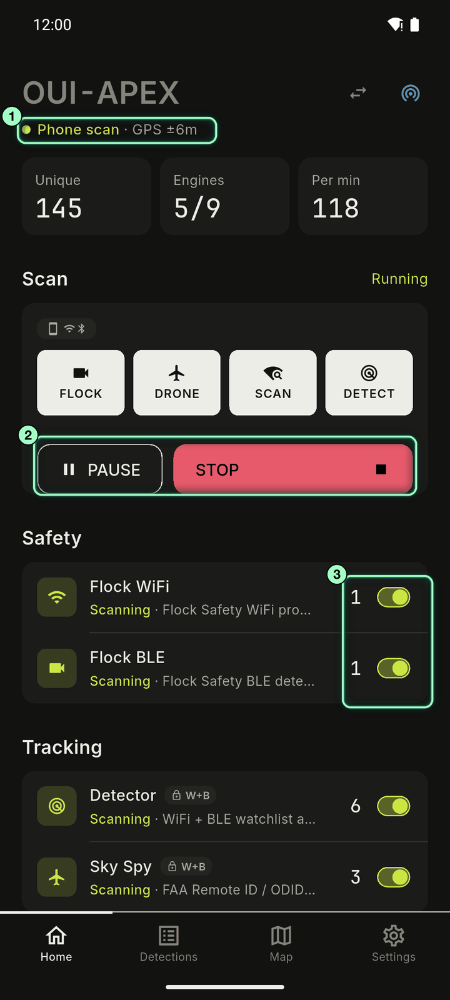
      <ol>
        <li><b>Status</b>: what is scanning and how good the GPS fix is.</li>
        <li><b>Pause / Stop</b>: pause or end the session. A stopped session is saved.</li>
        <li><b>Hit counts</b>: hits per engine this session, next to its switch.</li>
      </ol></td>
  </tr>
</table>

During a session, the phone shows live counts outside the app too:

- **iOS:** live counts and alerts show on the Lock Screen and Dynamic Island, and in CarPlay on iOS 26.
- **Android:** an ongoing notification shows live counts and the last alert.

### Detections

Everything the boards and the phone hear shows up here, live. Tap any row for its details. Tap any hit to see what it is and why, and to foxhunt or map it. Show all maps every hit of that class.

<table>
  <tr>
    <td width="50%" valign="top">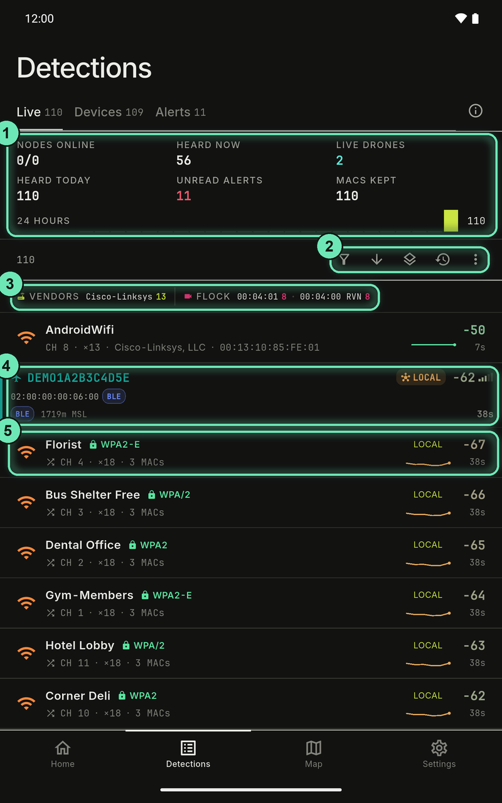
      <ol>
        <li><b>Live counts</b>: nodes online, devices heard now and today, live drones, unread alerts, MACs kept, and the last 24 hours.</li>
        <li><b>Tools</b>: filter, sort, group Wi-Fi clients under their network, open Alerts, and more.</li>
        <li><b>Top vendors and Flock</b>: tap a vendor to show only its devices.</li>
        <li><b>A drone</b>: its Remote ID, the radio that heard it, and its altitude.</li>
        <li><b>A network</b>: one row per network name. "3 MACs" counts the radios that use it.</li>
      </ol></td>
    <td width="50%" valign="top">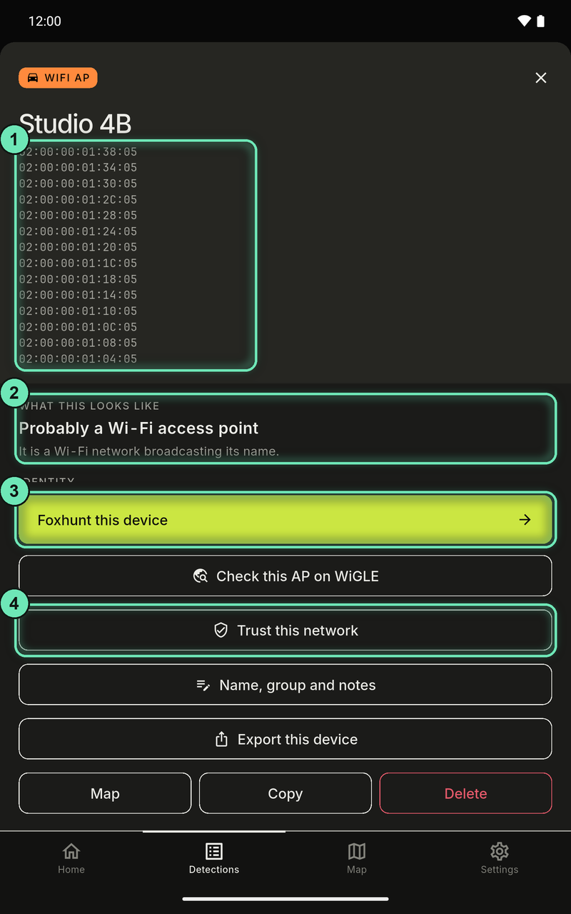
      <ol>
        <li><b>MACs</b>: every MAC that uses this network name.</li>
        <li><b>What this looks like</b>: the app's best guess, in plain words.</li>
        <li><b>Foxhunt this device</b>: follow its signal to the source.</li>
        <li><b>Trust this network</b>: warns you later about lookalikes. See <a href="#watches">Watches</a>.</li>
      </ol></td>
  </tr>
</table>

<p align="center">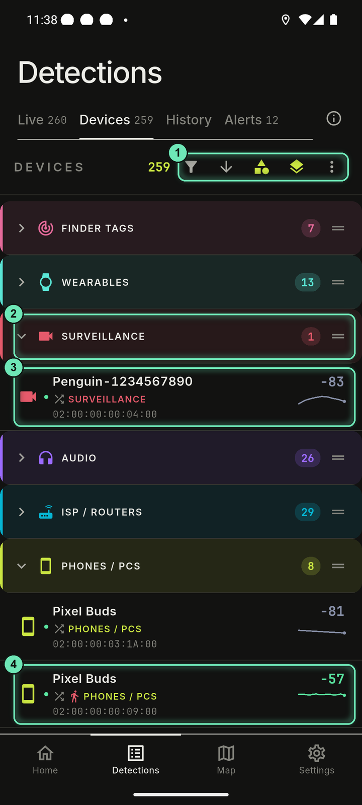</p>
<ol>
  <li><b>Tools</b>: filter, sort, group by type, and group Wi-Fi clients under their network.</li>
  <li><b>A device type</b>: tap to open it. The handle arranges the sections.</li>
  <li><b>A camera you drove past</b>: its line shows the signal getting stronger, then weaker.</li>
  <li><b>With you</b>: the walking icon marks a device that moves with you, such as your own earbuds.</li>
</ol>

- **Search everything:** on Live, open search and type. Every word must match a MAC, name, maker, reason or node. Chips show the matches in Devices, Alerts, Drones, Nodes and Wardrive. Tap a chip or **Everything** for the results sheet, and tap a match to open it.
- **Filter by maker:** on Live, tap a vendor in the strip above the list to show only its devices.
- **Live counts:** above Live, nodes online, devices heard in the last minute, live drones, devices heard today, unread alerts and MACs kept. Under them, the devices heard in each of the last 24 hours and their total.
- **One row per network:** Live shows one row per network name. The row's details list every MAC that uses that name.

The info button at the right end of the Detections tab row explains each tab and icon. These are the icons you will see most:

| Icon | What it does |
|---|---|
| **Two arrows** (Home) | Opens the Connect screen, with or without a board linked. |
| **Funnel** | Filters by engine, radio, node or class. |
| **Arrow** | Picks the sort order. Time lists Wi-Fi first, then Bluetooth, newest first. Tap again to reverse. |
| **Layers** | Indents each Wi-Fi client under the network it uses. On Live and Devices. |
| **Shapes** (Devices) | Switches between class sections and one flat list. |
| **Clock** (Live) / **Antenna** (Alerts) | Opens Alerts / goes back to Live. |
| **Folder** (Alerts) | Opens saved sessions. |
| **Three dots** | More actions for the tab, such as search, export and clear. |
| **Crossed arrows** on a row | The device uses a random MAC. |
| **Crossed-out eye** on a row | The network hides its name. |
| **Lock** on a row | The network security, such as WPA2. |
| **Walking person** on a row | A loud Bluetooth device that keeps moving with you. |

### Alerts

You choose which device types alert you. Every alert and every Flock, Detector, drone and SDR hit lands in one list, newest first.

<table>
  <tr>
    <td width="50%" valign="top">
      <ol>
        <li><b>Dismiss all / Silence all</b>: mark every alert read, or stop sounds and notifications until you turn them back on.</li>
        <li><b>An alert on a device</b>: shown on that device's row, here a drone hovering near you.</li>
        <li><b>A watch alert</b>: here an aircraft circling you. Tap a row for the map, the device and Delete.</li>
        <li><b>A Flock or detector hit</b>: its confidence, channel and how often it was heard. Unread alerts are tinted.</li>
      </ol></td>
    <td width="50%" valign="top">
      <ol>
        <li><b>Alert threshold</b>: how sure a detector hit must be before it notifies you.</li>
        <li><b>Bell</b>: notify, or only log it.</li>
      </ol></td>
  </tr>
</table>

[Alerts and watches](#alerts-and-watches) covers the watchlist, alert sounds and muting.

### Map

Every hit is placed where you heard it, along your route. The numbers are how many hits share a spot.

<table>
  <tr>
    <td width="50%" valign="top">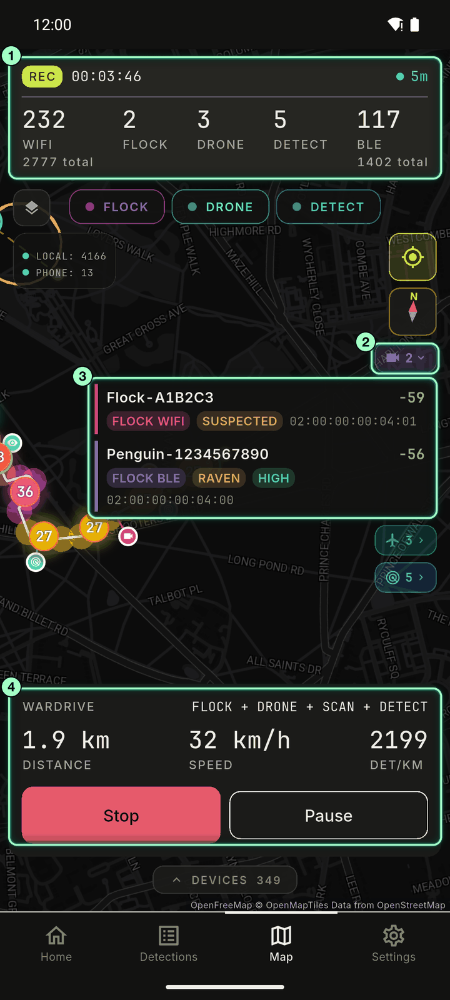
      <ol>
        <li><b>Session</b>: time recording, and counts of Wi-Fi, Flock, drone, detector and BLE hits.</li>
        <li><b>Flock list</b>: tap the chip to open or close it. Tap a row to zoom the map to it. Drones and detector hits have their own lists.</li>
        <li><b>Drive</b>: distance, speed, hits per km, and Stop / Pause.</li>
      </ol></td>
    <td width="50%" valign="top">
      <ol>
        <li><b>Saved session</b>: unique devices, total hits and distance.</li>
        <li><b>Lists</b>: Flock, drone and detector hits from this session.</li>
        <li><b>A drone</b>: its flight path and its pilot.</li>
        <li><b>A cluster</b>: tap it to list the devices there.</li>
        <li><b>Sessions</b>: open, export or delete saved sessions.</li>
      </ol></td>
  </tr>
</table>

[Map and drones](#map-and-drones) covers pins, offline maps, map layers, the drone list and zones.

### Sessions and reports

Every session is saved. Open one to replay it on the map, or open its report.

<table>
  <tr>
    <td width="50%" valign="top">
      <ol>
        <li><b>Select, Import, Clear all</b>: pick several sessions, load a WiGLE CSV, or delete them all.</li>
        <li><b>A session</b>: when, how long, how far, and its Wi-Fi, BLE, Flock, drone and detector counts. Tap it to replay it on the map.</li>
      </ol></td>
    <td width="50%" valign="top">
      <ol>
        <li><b>Totals</b>: Wi-Fi networks, how many were new, and Bluetooth devices.</li>
        <li><b>Wi-Fi networks</b>: new, seen before, hidden, and per band.</li>
      </ol></td>
  </tr>
</table>

<p align="center"></p>
<ol>
  <li><b>Detections</b>: Flock cameras, drones and watchlist hits.</li>
  <li><b>Alerts</b>: every alert kind raised during the session. Further down, whether it was uploaded to WiGLE and WDGWars.</li>
</ol>

### Accounts and capture database

Link your WiGLE and WDGWars accounts in Settings → Data → **Accounts** to upload sessions. Settings → Data → **Capture Database** totals everything your own wardrives have logged.

<table>
  <tr>
    <td width="50%" valign="top">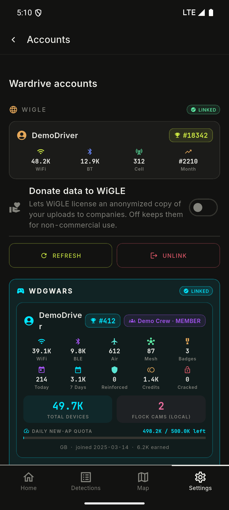
      <ol>
        <li><b>WiGLE</b>: enter your API name and token to link it. Once linked, it shows your rank and the Wi-Fi, Bluetooth and cell networks you found.</li>
        <li><b>Donate data to WiGLE</b>: lets WiGLE license an anonymized copy of your uploads. Off keeps them for non-commercial use.</li>
        <li><b>Refresh / Unlink</b>: reload your stats or remove the account.</li>
        <li><b>WDGWars</b>: enter your API key to link it. Once linked, it shows your rank, gang, counts and the daily new-AP quota.</li>
      </ol></td>
    <td width="50%" valign="top">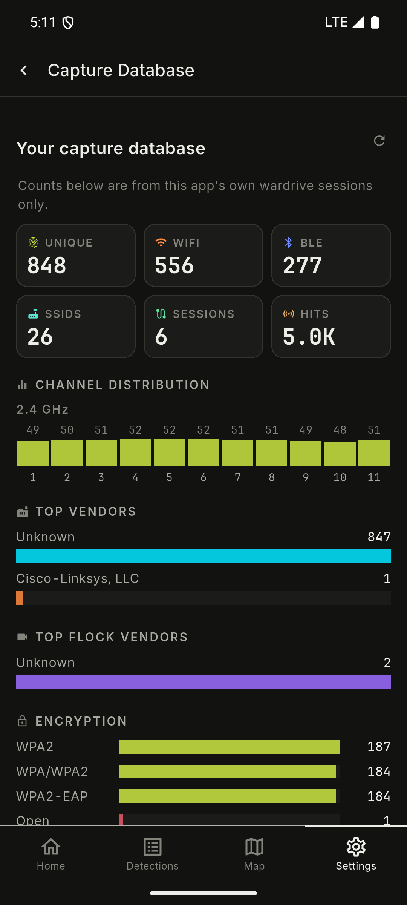
      <ol>
        <li><b>Totals</b>: unique devices, Wi-Fi, BLE, network names, sessions and hits.</li>
        <li><b>Channel distribution</b>: how many networks were heard on each channel.</li>
        <li><b>Top vendors and Flock vendors</b>: the makers seen most often.</li>
        <li><b>Encryption</b>: how many networks use each kind of security.</li>
      </ol></td>
  </tr>
</table>

### Scan timing and channels

Settings → Scanning sets how the board steps through Wi-Fi channels and Bluetooth, and when it logs a device again.

<table>
  <tr>
    <td width="50%" valign="top">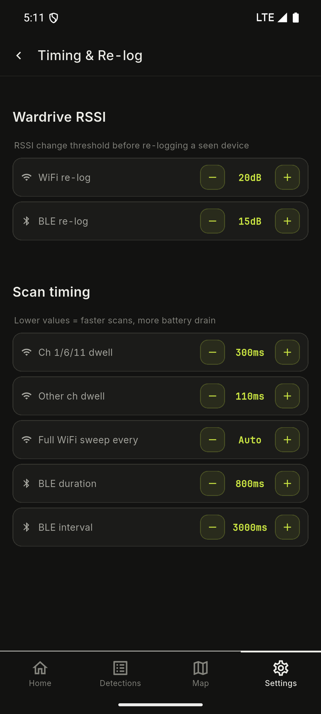
      <ol>
        <li><b>Wardrive RSSI</b>: how much a seen device's signal must change before it is logged again, for Wi-Fi and BLE.</li>
        <li><b>Scan timing</b>: how long the board stays on channels 1, 6 and 11 and on the others, how often it sweeps every Wi-Fi channel, and how long and how often it scans Bluetooth. Lower values scan faster and use more battery.</li>
      </ol></td>
    <td width="50%" valign="top">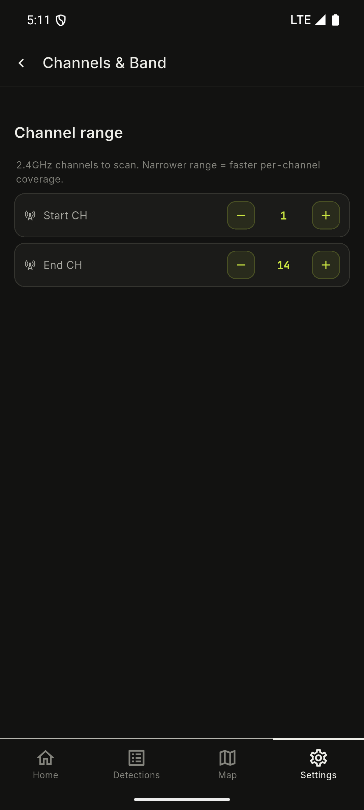
      <ol>
        <li><b>Channel range</b>: the first and last 2.4 GHz channel to scan. A narrower range spends more time on each channel. C5 boards also pick the Wi-Fi band here.</li>
      </ol></td>
  </tr>
</table>

### Phone scan

The phone can scan with its own radios, with or without a board. Tap **Use this device** on Home or the Connect screen, or the phone icon in the status bar, to start it. It is off at launch.

- iPhone hits skip WiGLE CSV, because iOS hides MAC addresses.
- iOS also removes Apple's manufacturer data, so a nearby iPhone, AirPods or AirTag arrives as a blank advert. It shows as *Possibly Apple, hidden by iOS*.
- The iPhone app then connects to that device for a moment and checks its services (Find My, AirTag, iPhone notification service) to name the kind. It never connects to your own boards.

### Tips

- **Too many notifications:** when alerts pile up within a minute, the app offers to turn off notifications for one noisy type. Its detections are still logged.
- **Hide addresses for screenshots:** turn on **Mask identifiers on screen** in Settings → Detection & Alerts → Privacy.
- **What does this icon mean:** tap the info button on a screen. It explains each tab and icon there.

## What it detects

The boards run detection programs called engines. You turn each engine on from Home, and each one looks for a different kind of device.

| Engine | What it finds |
|---|---|
| **Detector** | Your watchlist plus built-in signatures, all off by default. See the lists below. |
| **Flock BLE / Flock WiFi** | Flock Safety ALPR cameras, Raven gunshot sensors, Penguin and Pigvision. Optional OUI-only Wi-Fi hits. |
| **Sky Spy** | Drones broadcasting FAA Remote ID over BLE and Wi-Fi: ID, position, altitude, speed, pilot position. |
| **Foxhunter** | One target device. The board beeps faster as you get closer. The app's Find it view shows the signal and a ring that pulses faster, and the phone can buzz with it. |
| **UniPwn** | Unitree robots by BLE name (`Go2_`, `G1_`, `H1_`, …). |
| **Wardrive** | Every Wi-Fi AP and BLE device, GPS-stamped, in WiGLE CSV format. 2.4 GHz channels 1–14 by default. C5 boards add 5 GHz including DFS, and [802.15.4](#802154-wardrive-c5-boards). |
| **PCAP** | Raw 802.11, BLE advertising or (C5 boards) 802.15.4 frames to a Wireshark `.pcap`. |
| **AXEOFF** | Axon gear only, on Bluetooth and Wi-Fi, passive. The board plays a tone when Axon gear appears, while it stays near, and when it leaves. |
| **BLE Sniff** | Every Bluetooth LE advert as a live list, with filters and **Record PCAP**. Passive. Needs the board connected to the phone directly, or picked as the node on a manager. |
| **FPV receiver** | Analog 5.8 GHz FPV video transmitters on 44 of the 48 standard channels. XIAO ESP32-C5 only. See [FPV receiver](#fpv-receiver). |

<details>
<summary>Built-in Detector signatures</summary>

- **Trackers:** tracker tags following you (AirTag, AirPods and other Find My items, SmartTag, Tile, Google Find Hub, Chipolo, Pebblebee, DULT-standard tags); floods of new tracker tag addresses
- **Hacking tools and attacks:** Flipper Zero; Pwnagotchi; Wi-Fi deauth floods; floods of join requests at one access point; Wi-Fi beacon floods (one radio faking 15+ networks); directed probes; evil-twin and KARMA rogue access points
- **Mesh radios:** Meshtastic and MeshCore
- **Glasses and wearable cameras:** Meta Ray-Ban / Oakley glasses; GoPro, Insta360, Snap Spectacles, Even Realities, Vuzix, Brilliant Labs Frame, PLAUD
- **Police and public safety:** Axon / law-enforcement gear; Motorola Solutions radios and body cams; i-PRO body cams; police and fleet vehicle routers
- **Cameras:** security, doorbell and dash cameras by vendor OUI or camera brand in the network or device name (Ring, Nest, Arlo, Blink, Wyze, Hikvision, Dahua and others); Amazon Sidewalk BLE
- **Vehicles:** Teslas; Bluetooth OBD-II dongles
- **Drones over Bluetooth:** Remote ID, DJI

</details>

> [!IMPORTANT]
> The Flock OUI list comes from upstream FlockYou and matches Ubiquiti, Espressif and other common consumer parts. Check a hit with your own eyes before reporting it anywhere.

### Choose what alerts you

In Settings → **Detection & Alerts** → **What to Watch For**, each type can **alert** (notification plus a map pin), **log only** (tap the bell to record it without notifying), or be off. **OUI-based detection is an optional setting.** **Alert threshold** at the top sets how strong a detector hit must be to notify. **More device types** adds everyday radios: wearables, health, audio, phones / PCs, home IoT, thermostats, access control, vehicles, ISP / routers, mesh, beacons, signage and other.

### Flock confidence

Each Flock hit gets a tier that says how much evidence matched. Detections → Alerts can filter by tier.

| Tier | Matched |
|---|---|
| **Verified** | Bare-serial name + XUNTONG `0x09C8` manufacturer ID + TN serial |
| **High** | One strong signal: Raven service UUID, Flock BLE name, or a Flock wildcard probe with the Flock IE signature |
| **Suspected** | A listed OUI only, including a wildcard probe without the IE signature |

Settings → Node → **Flock Detection** adds two board options for more Flock hits.

<p align="center">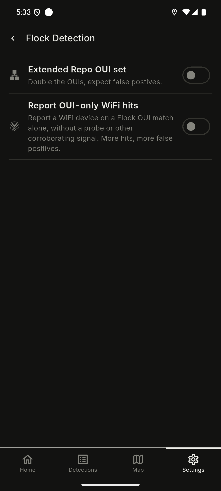</p>
<ol>
  <li><b>Extended OUI set</b>: roughly doubles the Flock maker prefixes. Expect false positives.</li>
  <li><b>Report OUI-only WiFi hits</b>: reports a Wi-Fi device on its maker prefix alone. More hits, more false positives.</li>
</ol>

### Classification

Every device the app hears gets a class, such as tracker, camera, public safety & fleet, drone, glasses, hacking tool, router, or home & office.

- Class alerts are on by default.
- A Samsung SmartTag away from its owner keeps its path when its address changes. The **With you** filter still finds it.
- **Suggested signatures** (Devices → More) groups 3+ unclassified radios that share a name, service, vendor prefix or company. **Save** turns a group into your own signature, with an optional alert on new matches.
- **Signature sets** (Settings → Detection & Alerts → Your Lists) adds the Fieldwatch stock catalog, Home Assistant's Bluetooth device list, or your own set from an https link or file (Fieldwatch JSON). A set adds only what the built-in catalog lacks. **Export** in My signatures shares yours as a set. The first launch of each new app version lists every signature source, with the extended Flock OUI set off, and asks which ones you want.

## Alerts and watches

Beyond single devices, the app can watch for patterns, keep a watchlist of your own, and play a tune on the board for each kind of alert.

### Watches

- **Seen at your stops** (Alerts → More): radios heard at 2 or more of your stops in the last 7 days.
- **Trusted networks** (**Trust this network** on an access point): warns when a lookalike appears with weaker security, another maker, or far from home.
- **Cell and GPS watch** (Android, Settings → Detection & Alerts → This Phone): warns on a drop to 2G or 3G, a new tower at a known place, or faked GPS.
- **Movement alerts** (off by default): a car following you (needs an RTL-SDR), an aircraft circling, a drone hovering near you, or a device moving between nodes.

### Watchlist

The watchlist holds devices you want the Detector engine to catch. Each rule matches one way of recognizing a device.

- **Add a rule** (**+** on the watchlist): a MAC, maker prefix, name, company ID or data, service UUID, or Wi-Fi probe or beacon prefix. In name patterns, `#` is a hex digit, `?` any character and `*` any run.
- **Alert when a board hears it** (tap a Bluetooth device): adds it to every board's watchlist. **Undo** takes it back.
- **Import and export:** CSV or JSON in Settings → Detection & Alerts → Your Lists. CSV rows are `identifier,description,kind`.
- **Rule limits:** a board holds 50 MAC and prefix rules, 50 service UUIDs and 32 other rules.
- **Watched devices** alert with their own label and sound, even when muted.

<p align="center">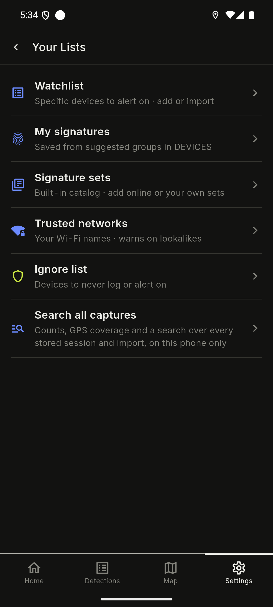</p>
<ol>
  <li><b>Watchlist</b>: the devices you want alerts on. Add rules or import them.</li>
  <li><b>My signatures and Signature sets</b>: your saved signatures and the sets you turned on.</li>
  <li><b>Trusted networks</b>: your own Wi-Fi names, for lookalike warnings.</li>
  <li><b>Ignore list</b>: devices never logged or alerted on.</li>
  <li><b>Search all captures</b>: counts, GPS coverage and a search over every stored session and import.</li>
</ol>

<details>
<summary>Watchlist rule types</summary>

- Exact MAC
- Maker prefix
- Bluetooth name contains, starts with, or pattern
- Bluetooth company ID
- Company data with a mask
- 16-bit or 128-bit service UUID
- Wi-Fi probe prefix
- Wi-Fi beacon prefix
- Phone-only maker name

</details>

### Sounds and muting

- **Alert sounds** (Notifications, or Node → Sound & Lights): the tune the board's buzzer plays for each kind of alert. Every alert starts on its default; tap one to pick another tune or Silent. Each play button tries the tune on the board.
- **Repeat for a device** (Notifications): alerts again after the device goes 60 s unheard.
- **Node down / Node back:** alerts when a mesh node goes missing for 45 s, and when it returns.
- **Silence all** (Alerts): stops every sound and notification until you turn it off. Alerts are still logged.
- **Mute alerts for this device** (the device's sheet): silences one device. It is still logged.

<table>
  <tr>
    <td width="50%" valign="top">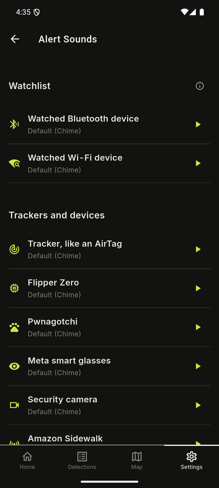
      <ol>
        <li><b>An alert</b>: what it plays now. Tap it to change the tune.</li>
        <li><b>Play</b>: tries that tune on the board.</li>
      </ol></td>
    <td width="50%" valign="top">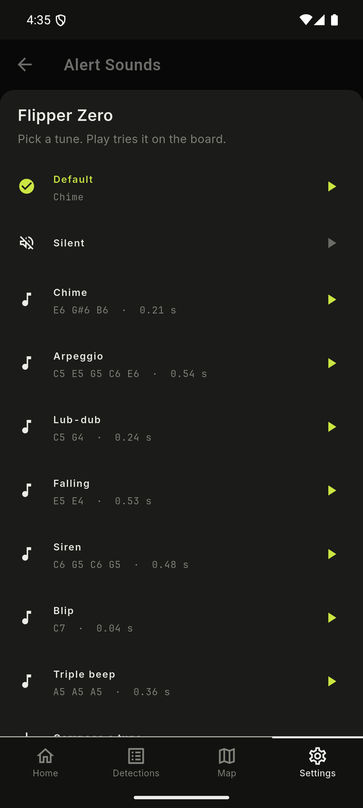
      <ol>
        <li><b>Default</b>: the tune the board plays if you never change it.</li>
        <li><b>Silent</b>, the built-in tunes and your own. Play any of them before you pick.</li>
      </ol></td>
  </tr>
</table>

<table>
  <tr>
    <td width="50%" valign="top">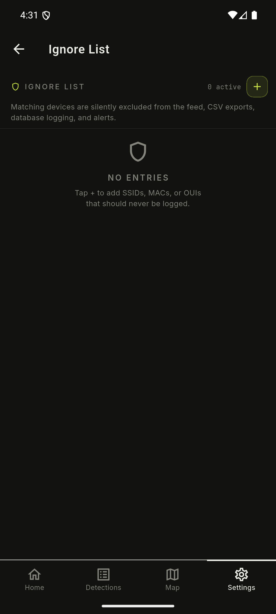
      <ol>
        <li><b>Notes</b>: up to 8. The arrows move a note up or down a semitone.</li>
        <li><b>Length and Pause after</b>: how long each note plays, then how long the board waits.</li>
      </ol></td>
    <td width="50%" valign="top">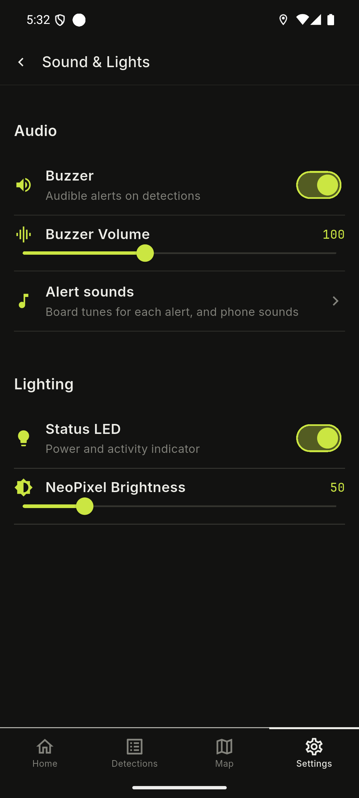
      <ol>
        <li><b>Buzzer and Buzzer Volume</b>: turn the board's buzzer on or off and set how loud it is.</li>
        <li><b>Alert sounds</b>: opens the tune list above.</li>
        <li><b>Status LED and NeoPixel Brightness</b>: the board's lights.</li>
      </ol></td>
  </tr>
</table>

<p align="center">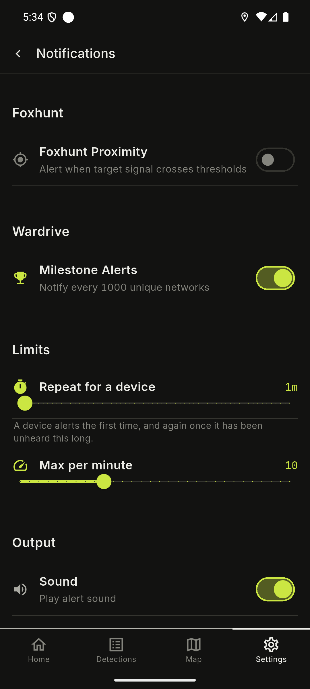</p>
<ol>
  <li><b>Foxhunt Proximity</b>: alerts when a foxhunt target's signal crosses its thresholds.</li>
  <li><b>Milestone Alerts</b>: a notification every 1000 unique networks.</li>
  <li><b>Repeat for a device and Max per minute</b>: when a device alerts again, and the most alerts a minute.</li>
  <li><b>Sound</b>: plays an alert sound on the phone. Further down are vibration, alert sounds and muted types.</li>
</ol>

## Map and drones

The map shows every hit along your route. These tools add your own marks, offline areas and extra layers.

### Map tools

- **Pins:** hold the map to drop one. Tap it to rename or remove it.
- **Measure:** tap the ruler, then tap points on the map.
- **Offline maps:** the download button saves the area in view, up to 3,000 tiles.
- **Triangulation** (off by default): place 3 or more nodes with **Place at my position**. The map then estimates where a device is, with an error ring.
- **Mapped ALPRs:** marks a Flock hit `ON MAP` when OpenStreetMap lists a plate camera within 75 m.
- **WDG territory:** shows a linked account's WDGWars territory.

### Drones

- **Drones list** (Sky Spy → history): every drone in a time window. Tap one for its tag, notes, flight map, pilot, FAA record and kit.
- **Remote ID or FPV:** chips that filter the Drones list.
- **Follow on map:** keeps a Remote ID drone centered as it moves.
- **Detection location:** a drone's flight shows where your phone was when it was first heard, and the range.
- **Tags:** mark a drone Friendly, Neutral, Suspicious or Hostile. The tag colors its marker.
- **Drone log:** Remote ID reports are kept 90 days. **Export logs** saves CSV or KML.
- **Drone kit:** link a drone's controller, goggles, pilot phone and other devices. The app suggests likely ones.

### Zones

- **Geofences:** a **Quiet** zone hides detections and silences boards inside it.
- **Alert zones:** with **In your zone** on, the app alerts when a drone or caught device is inside an **Alert** zone.

## Captures and special receivers

Besides detecting devices, the boards can record raw radio traffic. C5 boards can also log 802.15.4 devices, and a XIAO ESP32-C5 can find FPV video transmitters.

### Packet capture

The app saves Wi-Fi, BLE or 802.15.4 traffic as PCAP files that Wireshark opens.

- Start, pause and resume by hand, or let **Auto-PCAP** record 3–120 s when an engine fires.
- **802.15.4** and **5 GHz** need a C5 board.
- Saved captures are in Settings → Data → Captures.
- **Probes** (top of the PCAP screen): the network names nearby phones ask for, by device or by network.

### 802.15.4 wardrive (C5 boards)

802.15.4 is the radio that Zigbee and Thread smart-home devices use. C5 boards can log these devices during a wardrive.

- The **802.15.4 (Zigbee, Thread)** switch under the radio picker shows on C5 boards, and on a manager while a C5 node is live in the mesh. Only the C5 nodes listen on 802.15.4.
- The board listens on channels 11–26 for about 2.4 s of every 8 s, and pauses Wi-Fi and BLE meanwhile.
- Sightings show in lime in the feed and on the map, with PAN ID, source address, beacon info, channel and LQI.
- Receive only, never transmits. Sightings go in the detections CSV, not in WiGLE exports.

### FPV receiver

On a XIAO ESP32-C5 the app finds analog 5.8 GHz FPV video transmitters. It receives only and shows no picture. Open it from the **FPV receiver** tile on Home.

<p align="center">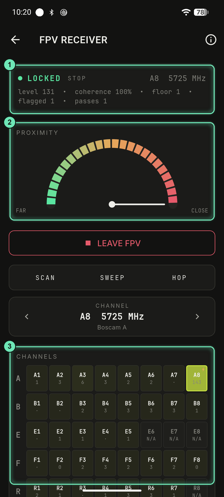</p>
<ol>
  <li><b>Status</b>: Locked, Tuned or the running mode, the channel, its level, coherence and noise floor, and how many channels are flagged.</li>
  <li><b>Proximity</b>: the needle moves toward Close as the tuned channel rises above the floor.</li>
  <li><b>Channels</b>: brighter is stronger, a bolt marks a flagged transmitter, and tapping a cell holds that channel.</li>
</ol>

- **Channels:** bands A, B, E, F, R and L. R8, E6, E7 and E8 are out of the C5's range, and L-band is experimental.
- **Modes:** **Scan** stops on the strongest transmitter, **Sweep** keeps the grid live, and **Hop** visits flagged channels. Tap a cell or use the arrows to hold a channel.
- **Flags:** a channel is flagged when it is 12 above the noise floor (the **Flag threshold**) with a steady carrier. Levels are relative, not dBm.
- **Bleed:** a transmitter also reaches channels within 19 MHz. Only the strongest one lights up.
- **Feed:** flagged channels show in Sky Spy, the Drones list and the feed, with no position.
- **Limits:** Wi-Fi engines pause while FPV runs. FPV won't start while the mesh or ESP-NOW hub is on, and isn't on the T-Dongle-C5 or manager builds.
- **Pins:** keep GPIO 1, 0, 23, 7, 10, 5, 3 and 4 unconnected.

## Hardware

This section lists the boards the firmware runs on, the USB radios the Android app drives, and the optional GPS module.

### Boards

Pick the flasher target that matches your board. Node targets scan. Manager targets connect the phone to a mesh and do no scanning.

| Board | Bands | Screen and buttons | microSD | Buzzer | Mesh node | Flasher target |
|---|---|---|---|---|---|---|
| XIAO ESP32-S3 | 2.4 GHz | None | No | GPIO3 (OUI-SPY board) | Yes | `node-xiao_s3` |
| ESP32-S3 N16R8 DevKitC | 2.4 GHz | None | No | GPIO3 | Yes | `node-s3_devkitc` |
| XIAO ESP32-C5 *(experimental)* | 2.4 + 5 GHz | None | No | GPIO25 | Yes | `node-xiao_c5` |
| LilyGO T-Dongle-S3 | 2.4 GHz | LCD, 1 button, RGB LED | Yes | No | Yes | `node-tdongle_s3` |
| LilyGO T-Dongle-C5 *(experimental)* | 2.4 + 5 GHz | LCD, 1 button, RGB LED | Yes | No | Yes | `node-tdongle_c5` |
| M5StickC PLUS | 2.4 GHz | LCD, 3 buttons | No | Built in | No | `node-stickc_plus` |
| M5StickC PLUS2 | 2.4 GHz | LCD, 3 buttons | No | Built in | No | `node-stickc_plus2` |
| M5StickC (original) | 2.4 GHz | LCD, 3 buttons | No | No | No | `node-stickc` |

- **Manager boards:** XIAO ESP32-S3 (`mgr-xiao_s3`), ESP32-S3 DevKitC (`mgr-s3_devkitc`), XIAO ESP32-C5 (`mgr-xiao_c5`), XIAO ESP32-C3 (`mgr-xiao_c3`), ESP32 WROOM (`mgr-wroom`).
- **No mesh:** the M5StickC, PLUS and PLUS2 skip mesh to fit their RAM. They connect straight to the phone or run standalone.
- **Disabled, not hidden:** a control the connected board can't use stays visible, dimmed, with the reason.

### Offline scan and the JCMK node hub

A board can keep working when the phone is away, and it can collect networks from other wardriving gear.

- **Offline scan** (Settings → Node → Offline Scan): the board keeps scanning without the phone, even after a reboot, and uploads hits on reconnect. A directly connected board with a GPS module fix also wardrives, one row per device every 5 min, up to 1 MB. It stops after 60 s without a fix.
- **JCMK node hub** (Settings → Node → JCMK Node Hub): the board adds Wi-Fi networks from [Piglet](https://github.com/hamspiced/piglet) ESP-NOW nodes to your wardrive. Tap **Start hub**, power on a Piglet, and tap **Pair** under **Nearby nodes**. The hub board leaves the mesh while it runs. The wardrive radio picker can leave out any paired node.

<table>
  <tr>
    <td width="50%" valign="top">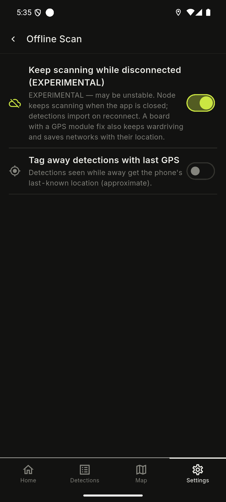
      <ol>
        <li><b>Keep scanning while disconnected</b>: experimental. Detections import when the phone reconnects.</li>
        <li><b>Tag away detections with last GPS</b>: gives detections from while you were away the phone's last known position.</li>
      </ol></td>
    <td width="50%" valign="top">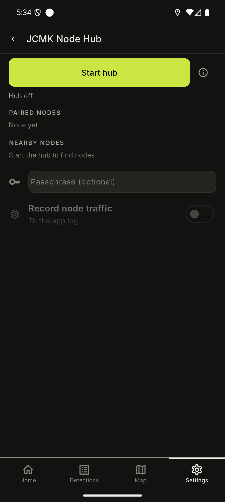
      <ol>
        <li><b>Start hub</b>: turns the board into a hub for Piglet and JCMK nodes.</li>
        <li><b>Paired and nearby nodes</b>: nodes you paired, and nodes the hub hears.</li>
        <li><b>Passphrase and Record node traffic</b>: an optional passphrase, and a copy of node traffic in the app log.</li>
      </ol></td>
  </tr>
</table>

### USB radios on Android

OUI-APEX drives a USB Wi-Fi adapter or RTL-SDR dongle with no root, kernel driver or custom ROM.

<div align="center">
<p align="center">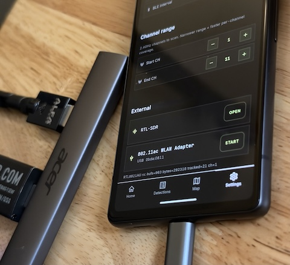<br><sub>Settings → Scanning → External Adapters</sub></p>
</div>

- **Setup:** plug it in, choose OUI-APEX when Android asks, and tick "Use by default for this USB device". The app then reclaims it after a restart. It shows on Home with its own Start control.

#### Wi-Fi adapters

- **Receive only:** the adapter scans in monitor mode and never transmits.
- **Firmware:** first use needs internet to download the chipset firmware from [linux-firmware](https://git.kernel.org/pub/scm/linux/kernel/git/firmware/linux-firmware.git/).

| Chipset | Scans |
|---|---|
| MediaTek MT7921AU | Wi-Fi (2.4 + 5 GHz) and Bluetooth LE |
| MediaTek MT7612U | Wi-Fi (2.4 + 5 GHz) |
| **Realtek RTL8812AU (Recommended)**/ RTL8814AU | Wi-Fi (2.4 + 5 GHz) |
| Atheros AR9271 | Wi-Fi (2.4 GHz) |
| Ralink RT3070 | Wi-Fi (2.4 GHz) |

On the MT7921AU (Alfa AWUS036AXM), pick BLE or WiFi+BLE on the radio control to scan Bluetooth LE.

#### RTL-SDR

Use an RTL2832U dongle with USB ID `0bda:2832` or `0bda:2838`. Open the SDR screen and pick a mode.

| Mode | Frequency | What it receives |
|---|---|---|
| **Spectrum** | You set it, 100.1 MHz by default | A live waterfall of signal strength across the band |
| **ADS-B** | 1090 MHz | Aircraft broadcasting their position and identity |
| **Scan** | 315, 433.92, or 915 MHz | The device types you pick from what the rtl_433 decoders recognize: weather stations, utility meters (including Wireless M-Bus and Itron / Silver Spring smart-meter mesh), security sensors, remotes and key fobs, home sensors and tire-pressure sensors |

<p align="center"></p>
<ol>
  <li><b>Bands</b>: pick 315, 433 or 915 MHz, or several to sweep them, then tap Start.</li>
  <li><b>Types</b>: tap a chip to turn that type on or off. Each chip counts what it found.</li>
  <li><b>Decoded devices</b>: newest first. Tap one for its details and to foxhunt it.</li>
</ol>

- **Smart meters:** mesh hits show which meter talks to which and through which gateway. Readings are encrypted.
- **History:** decoded devices save under an SDR filter, and you can foxhunt them.
- **ADS-B:** each aircraft's callsign, altitude, speed and photo, with its flight path on the map. One button uploads them to WDGWars.
- **Help:** the info button at the top of the SDR screen explains the mode you are in.

<table>
  <tr>
    <td width="50%" valign="top">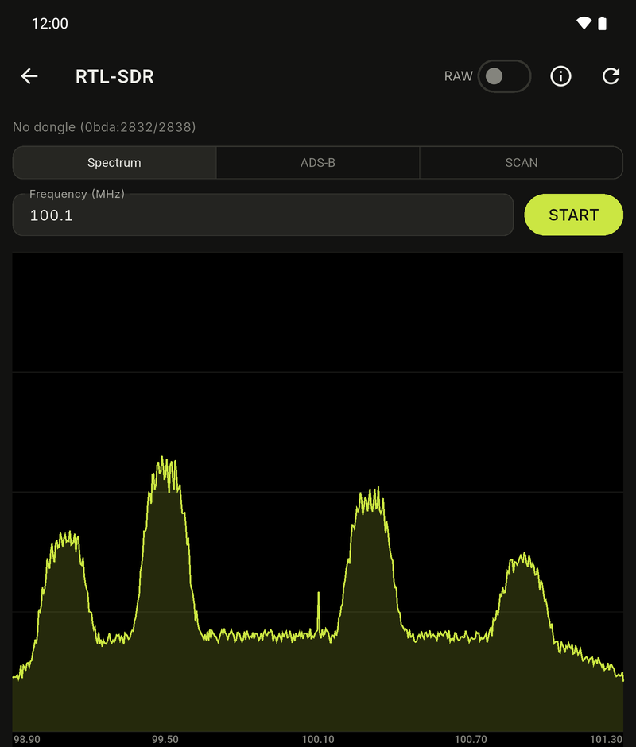</td>
    <td width="50%" valign="top">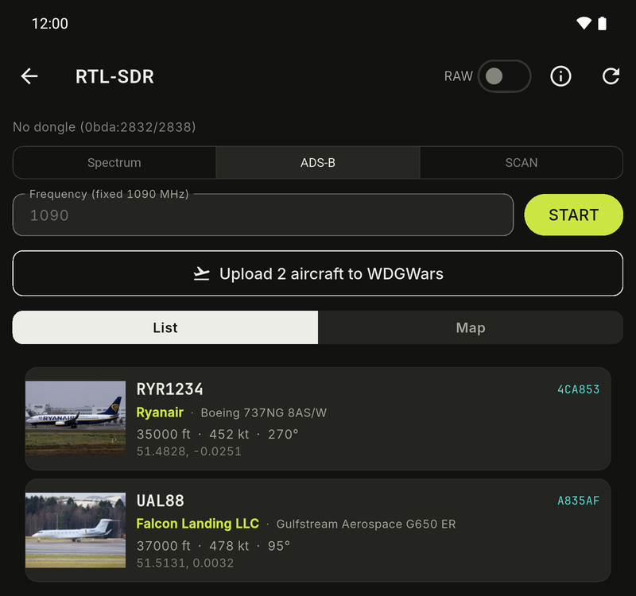</td>
  </tr>
</table>

<p align="center">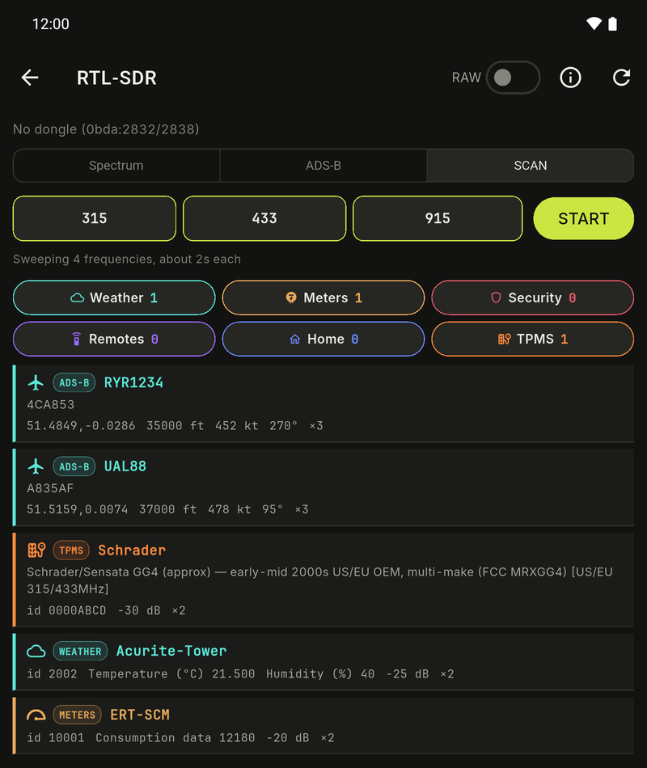</p>

### Optional GPS module

A serial GPS (NEO-6M / NEO-8M, 9600 baud) gives the board its own position. Its fix overrides phone GPS. After 5 s with no module data, the board uses phone GPS.

| GPS | XIAO ESP32-S3 | T-Dongle-S3 | T-Dongle-C5 | M5Stick |
|---|---|---|---|---|
| TX → | GPIO44 | GPIO44 | GPIO12 | GPIO33 |
| RX ← | GPIO43 | GPIO43 | GPIO11 | GPIO32 |

Other boards: set `-DPIN_GPS_RX=` / `-DPIN_GPS_TX=`.

<p align="center">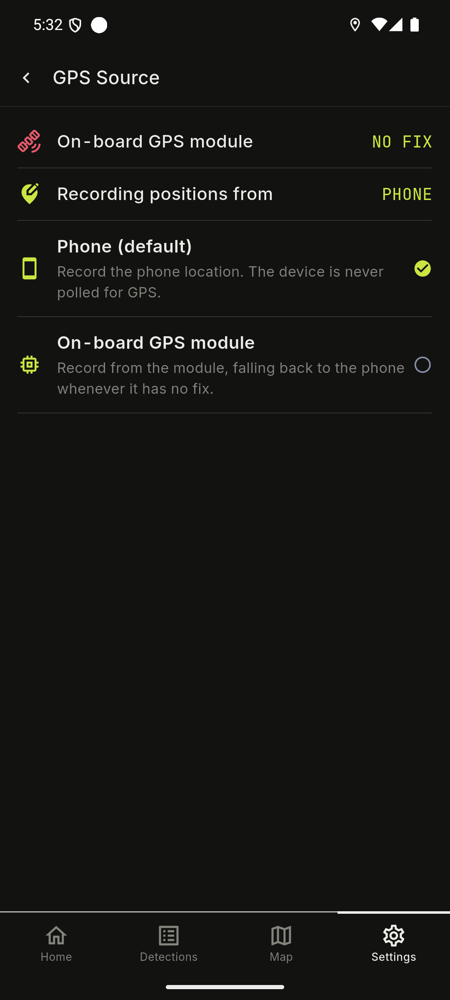</p>
<ol>
  <li><b>Status</b>: whether the module has a fix, and where positions come from now.</li>
  <li><b>Phone (default)</b>: records the phone's location.</li>
  <li><b>On-board GPS module</b>: records from the module, and falls back to the phone when it has no fix.</li>
</ol>

### Standalone controls

Boards with a screen and buttons run without a phone. You pick and start engines from the buttons.

#### T-Dongle-S3 / T-Dongle-C5

| Press | Action |
|---|---|
| 1 press | Select next mode |
| 2 presses | Start / stop selected mode |
| Hold | Open detections screen |
| Any press on detections screen | Back to main screen |

Modes: `DETECT FLOCKB FLOCKW FOXHNT SKYSPY UNIPWN WARDRV PCAP`.

Files go to `/OUISPY` on the card:

| File | Contents |
|---|---|
| `det_*.csv` | Every detection, with coordinates when a GPS fix exists |
| `wigle_*.csv` | Wardrive rows; written only with a GPS fix (phone or GPS module) |
| `cap_*.pcap` | Packet captures |

- **Filenames** use UTC time once GPS supplies it, otherwise a boot counter.
- **LED:** glows dim green while an engine runs, flashes the engine's color on a hit. The app's NeoPixel brightness slider sets the level; 0 turns it off.

#### M5StickC / PLUS / PLUS2

| Button | Press | Action |
|---|---|---|
| **A** (front) | tap | Select next mode |
| **A** | double-tap | Detections screen on / off |
| **A** | hold | Foxhunt the last alert (or the app's target); hold again to stop |
| **B** (side) | tap | Start / stop selected mode |
| **B** | hold | Buzzer on / off (PLUS and PLUS2) |
| **PWR** | tap | Screen brightness, four steps, last is off |
| **PWR** | hold | Power off |

Modes: `DETECT FLOCKB FLOCKW FOXHNT SKYSPY UNIPWN`. Wardrive and PCAP need the app on these boards (no SD card).

#### Screens on both

- **Main screen, top left:** selected mode (amber = selected, green = running).
- **Main screen, top right:** `APP` `MSH` `SD` `GPS` status.
- **Main screen, left:** unique Wi-Fi and BLE counts.
- **Main screen, right:** foxhunt target, `CAP` bytes while capturing, or speed.
- **Main screen, bottom strip:** one icon per mode, lit while running, underlined when selected, hit count below.
- **Detections screen:** the 4 latest detections, newest on top. Each row shows the engine icon, the name (12 characters, MAC address if none), dBm and signal bars. The header counts detections since boot.

Foxhunt picks, in order: the target set in the app, else the last Detector / Flock / Sky Spy / UniPwn alert seen by this board.

Detector MAC, OUI and UUID targets, their labels, and signatures set in the app stay on the board through a reboot. Name targets match in the app only.

## Mesh

A mesh lets several boards cover a wider area. One board, the manager, connects to your phone. Node boards up to about 200 m from it scan and send their hits to the manager, and the app shows them all together.

### How it works

- One manager connects to the phone; up to 6 nodes report to it over ESP-NOW on 2.4 GHz channel 1 until you move them (see **Channel** under [Fleet control](#fleet-control)).
- Nodes join on their own within about 10 s. Single hop: every node must reach the manager directly, about 200 m line of sight.
- Default is plaintext broadcast. Settings → Node → Mesh can switch to AES-256-GCM with a shared key.
- Boards use a random MAC each boot; the node ID stays fixed.
- A node silent for 45 s drops off and rejoins when back in range.
- The manager pushes buzzer, LED, alert, alert-sound, ignore-list, wardrive-radio and Wi-Fi-band settings to every node.
- Any mix of node boards works under one manager.

<p align="center">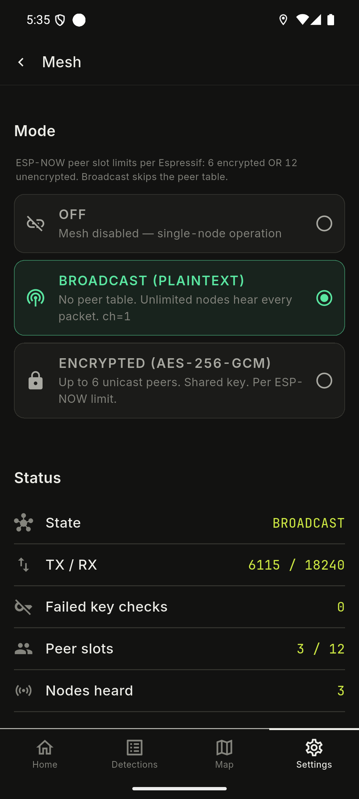</p>
<ol>
  <li><b>Mode</b>: off, broadcast (plaintext) or encrypted (AES-256-GCM).</li>
  <li><b>Status</b>: the mesh state, messages sent and received, failed key checks, peer slots and nodes heard.</li>
</ol>

### Manage nodes

With a manager connected, Settings → Node → Mesh → **Nodes** lists every node.

- **Rename a node:** tap the node, type a name of up to 32 characters, and tap **Save**. Leave it blank or tap **Clear** to go back to the node ID. The name is kept on this phone.
- **Find or restart a node:** tap a live node. **Identify** makes it beep and blink for 10 seconds. **Locate** makes it beep every 2 seconds until you tap **Stop locate**, for 30 minutes at most. **Reboot** restarts it. **Fleet control** below the list identifies or reboots every node at once.
- **Remove an old node:** tap a node you no longer use and tap **Forget**. The board you are connected to cannot be forgotten there.

### Node watchlists

- **Presets** (Settings → Detection & Alerts → Your Lists → Watchlist → **Presets**) are ten signature sets: Axon, Meta glasses, i-PRO, Verkada, Trackers, Drones, Vehicles, Wearables, Flipper and Police. Tap one for **Watch on phone** or **Install on nodes**. A node takes the rules it can hold, and the message counts the rest as skipped.
- **A node's filters** (a node in **Nodes** → **Filters**, through a manager) shows what one node watches for, and adds, removes, replaces or clears its rules. An edited node keeps its own list until the phone sends a new watchlist.
- **Watchlist results:** each node reports whether it took the watchlist, such as "On 3 of 4 nodes; NODE2 refused (list too long for it)".

### Fleet control

- **Read all** (Settings → Node → Mesh → **Fleet control**) shows each node's build, filters, uptime and peers under **Nodes**.
- **Signal** (Settings → Node → Mesh → **Signal**) shows how strongly each node hears each other node, one row per direction, updated about every 6 s.
- **Channel** (Settings → Node → Mesh → **Channel**) moves the whole mesh to channel 1 to 11. Every node confirms first, then all switch together without a reboot. If a node does not answer within 15 s, nothing moves unless you tap **Move anyway**. Update older nodes first.
- **Finding the fleet again:** a node that hears no manager for 2 minutes scans channels 1 to 11 to find it, then retries every 15 minutes.
- **Fleet metrics** (Settings → Node → Mesh → **Fleet control**) shows each node's build, uptime, peers and temperature, then the last hour, day, week or month of logged activity in three views: **Detections**, **Wardrive** and **Drones**.

<table>
  <tr>
    <td width="50%" valign="top">
      <ol>
        <li><b>Channel ⓘ</b>: how a move works.</li>
        <li><b>Channel now</b>: the mesh's current channel.</li>
        <li><b>Picker</b>: the channel to move to, 1 to 11.</li>
        <li><b>Move fleet</b>: asks every node to confirm, then all switch together.</li>
      </ol></td>
    <td width="50%" valign="top">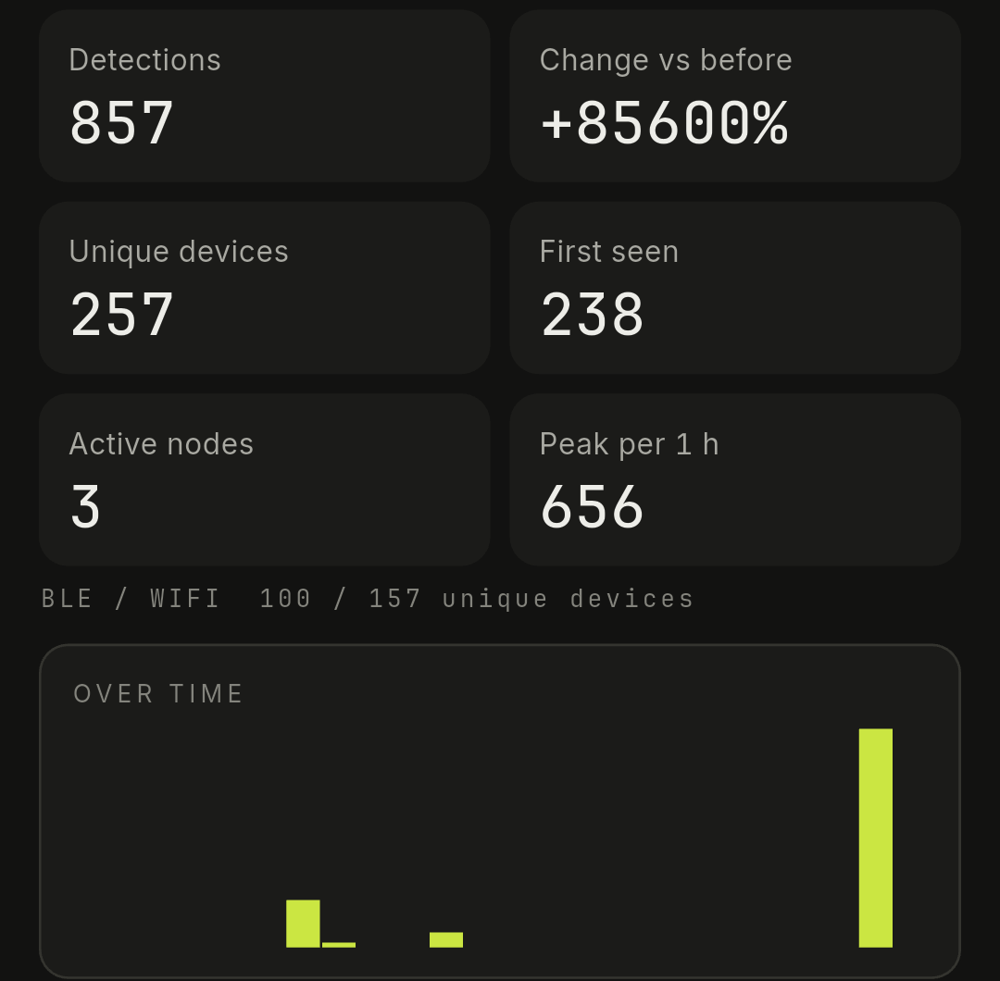
      <ol>
        <li><b>Totals</b>: detections, change against the span before, unique and new devices, active nodes and the busiest period.</li>
        <li><b>BLE / Wi-Fi</b>: unique devices on each radio.</li>
        <li><b>Over time</b>: detections per period in the chosen span.</li>
      </ol></td>
  </tr>
</table>

## Connect to other tools

The app can pass what it finds to other systems: a Meshtastic radio when you have no network, ATAK, a dashboard on your own computer, and a language model that can read the data with your permission.

<p align="center">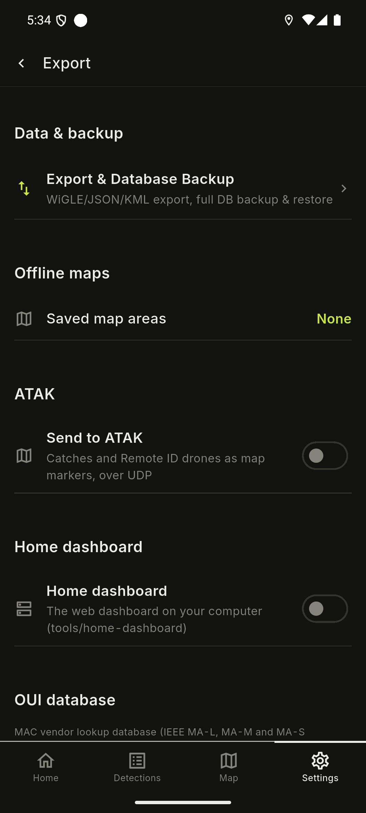</p>
<ol>
  <li><b>Export & Database Backup</b>: WiGLE, JSON and KML exports, and a full backup and restore.</li>
  <li><b>Saved map areas</b>: offline map areas you downloaded.</li>
  <li><b>Send to ATAK</b> and <b>Home dashboard</b>: see below.</li>
  <li><b>OUI database</b>: the maker lookup list, further down.</li>
</ol>

### Meshtastic radio

Pair your own Meshtastic radio to send a message or your position by LoRa when you have no network. Settings → Data → **Meshtastic radio**.

<table>
  <tr>
    <td width="50%" valign="top">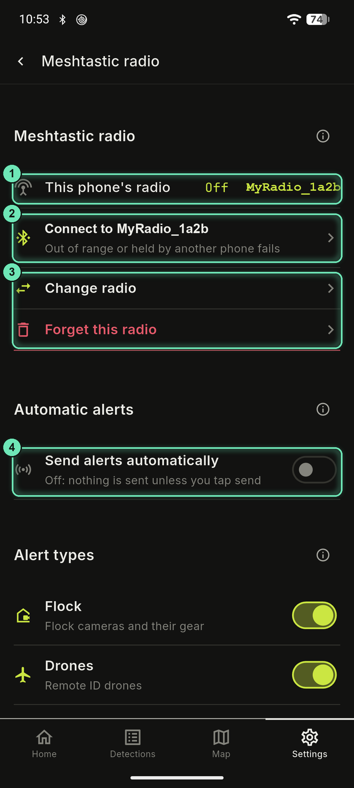
      <ol>
        <li><b>This phone's radio</b>: link state and the paired radio's name.</li>
        <li><b>Connect</b>: links to the paired radio. Close the Meshtastic app first.</li>
        <li><b>Change radio / Forget this radio</b>: pick another radio or drop this one.</li>
        <li><b>Send alerts automatically</b>: off until you turn it on and confirm.</li>
      </ol></td>
    <td width="50%" valign="top">
      <ol>
        <li><b>Alert types</b>: which alerts go out by LoRa when <b>Send alerts automatically</b> is on.</li>
        <li><b>Limits</b>: the shortest gap between two messages and the most messages a day.</li>
        <li><b>Sent today</b>: messages sent and alerts skipped by the limits.</li>
        <li><b>Send to</b>: the private channel, or up to 4 chosen nodes.</li>
      </ol></td>
  </tr>
</table>

- **Find a radio:** close the Meshtastic app first. The radio's default PIN is 123456.
- **Reconnect:** the app reconnects to the saved radio on its own.
- **Channel:** private channels only, never the public one.
- **Send a message** (up to 200 characters) or **Send my position** (asks first).
- **Heard on the radio:** recent messages on the private channel.
- **Automatic alerts:** each alert goes out as text with the device's address, never a position. Default limits are 60 s between messages and 50 a day.

### ATAK

The app sends catches and Remote ID drones to ATAK as Cursor-on-Target markers over UDP. Turn it on in Settings → Data → Export → **Send to ATAK**.

- **Where:** `127.0.0.1:4242` by default, ATAK on this phone. In ATAK, add a UDP input on that port.
- **What:** Remote ID drones with their pilots, and other catches at the phone's position. Wardrive rows are not sent.
- **SA multicast** (off by default): also sends to `239.2.3.1:6969`, readable by anyone on your Wi-Fi.

### Home dashboard

The home dashboard is a web page you run on your own computer, from the `tools/home-dashboard/` folder. A board plugged into that computer by USB feeds it the mesh's data. The page shows the nodes, their signal to each other, a map, drones, and a searchable detection history. It can read a node's status, make a node beep and flash, and reboot a node. Filters, presets and firmware stay in the app.

- **Run it** with `python3 ouispymesh.py` from that folder. See [its README](tools/home-dashboard/README.md).
- **Network:** it listens on `127.0.0.1` only. `--lan` lets other devices in, and then every one of them needs the access token. Only the token's hash is kept.
- Nothing starts by itself, and nothing goes online unless you turn on a map layer, a TAK server, Reticulum or an optional download.
- **TAK server** and **Reticulum** links and **MQTT** are set on the dashboard. The app turns them on and off.
- **Meshtastic:** sends alerts through a Meshtastic radio on the dashboard computer, at most one a minute per event type. Off until you turn it on.

To link the app to it, turn on Settings → Data → Export → **Home dashboard**. It is off by default.

- **Address:** the dashboard's address, with a port if it is not 5077. Start the dashboard with `--lan`.
- **Find on this network** (off by default): finds a dashboard started with `--lan --advertise`.
- **Access token:** the one the dashboard printed. Kept in secure storage.
- **Link:** the connection state, such as **Live**, **Home down** or **Refused**.
- **Connectors:** turn **MQTT**, **TAK server**, **Reticulum** and **Meshtastic** on or off. Set them up on the dashboard.
- **Meshtastic settings:** the dashboard radio's port, channel, nodes and which events go out. **Send a test** sends one message.
- **History kept:** days of detections to keep (0 keeps all). **Clear detection history** asks twice.

### Assistant

A language model can read what the app has seen and, when you allow it, change things. It is off by default. Turn it on in Settings → Data → **Assistant**, pick a model provider, then tap **Open the assistant**.

<p align="center">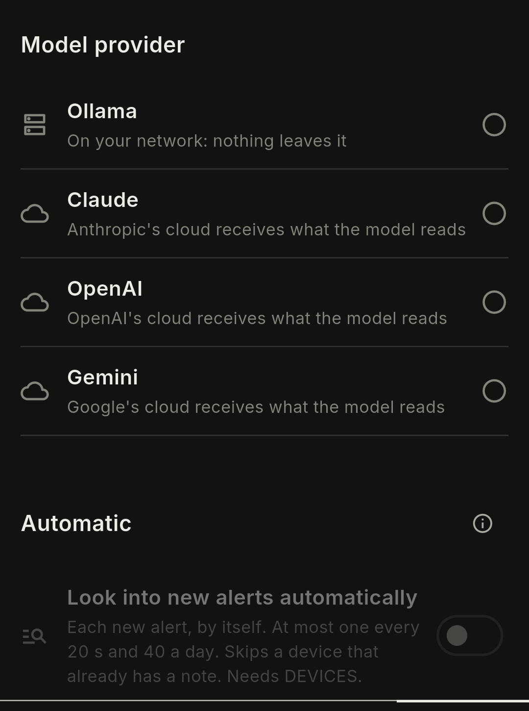</p>
<ol>
  <li><b>Model provider</b>: Ollama on your network, or Claude, OpenAI or Gemini in the cloud.</li>
  <li><b>ⓘ</b>: what the automatic features send and when.</li>
  <li><b>Automatic</b>: alert lookups and scheduled reports. Both are off until you turn them on.</li>
</ol>

- **Providers:** Ollama on your network, or Claude, OpenAI or Gemini. A cloud provider asks for your OK once. On Android, use https if **Check** fails on a LAN address.
- **API keys** stay in the phone's secure storage and go only to their provider.
- **Ask** is a chat that shows every tool the model runs. **Stop** cancels.
- **Intel** explains one device. It never sees where the device was.
- **Reports** sums up the last 6 to 48 hours.
- **Grants:** Devices, Drones, Wardrive, Mesh, Captures, Location, Control and Irreversible are each off until you allow them. With Location off, the model sees no positions.
- **Changes:** Control can name devices, switch some engines, run captures and restart the board. Irreversible can ask for a factory reset. Every board change waits for your OK.
- **Untrusted text:** device and network names reach the model as data, never as instructions.

## Updates

After the first USB flash, the boards update from the app over Wi-Fi or over the mesh. The app checks for its own updates in Settings.

### App updates

Settings → About → **Check for update**. **Check at launch** is off by default.

- **Signed:** the app installs only a newer release signed with the firmware release key, and checks the file's SHA-256.
- **Android:** **Install** opens the system installer.
- **macOS:** **Save to Downloads**, then replace the app yourself.
- **iOS:** update through TestFlight.
- **Maintainers:** `python3 sign_ota.py release <apk> <macos zip>` writes the signed manifest. `python3 sign_ota.py verify-release <folder>` checks it.

### Firmware updates

- **Over Wi-Fi** (Settings → Node → Firmware): each node downloads its own board's image. Nodes older than v0.6.1 get the board picked in the app.
- **Over the mesh** (Settings → Node → Mesh → **Fleet control**, or Settings → Node → Firmware): updates the nodes you tick with no Wi-Fi. Load a node build as a `.bin` file or from a link. The app checks the image, the chip and the signature before sending. Nodes update one at a time, each row shows its progress, and **Stop** cancels. Needs a manager on firmware with this feature.

<p align="center">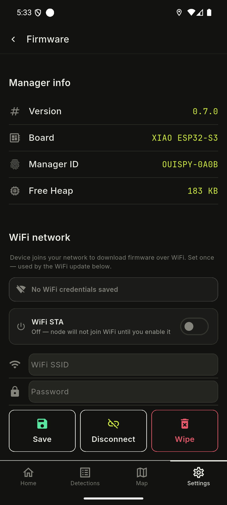</p>
<ol>
  <li><b>Manager info</b>: firmware version, board, ID and free memory.</li>
  <li><b>WiFi network</b>: the network the board joins to download firmware over Wi-Fi.</li>
</ol>

## Privacy

These settings limit what the boards and the phone send over the air and what the app shows on screen.

### Receive only

One switch in Settings → Detection & Alerts → Privacy stops every scan from transmitting.

<p align="center">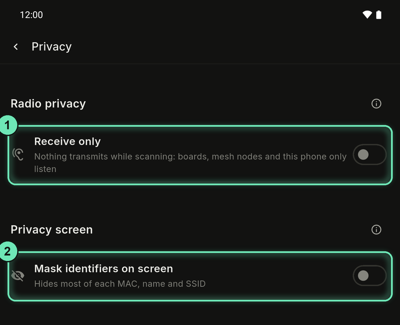</p>
<ol>
  <li><b>Receive only</b>: boards, mesh nodes and this phone only listen.</li>
  <li><b>Mask identifiers on screen</b>: hides most of each MAC, name and SSID on screen. Exports keep full values.</li>
</ol>

- **Boards:** each connected board stops Wi-Fi probe requests and Bluetooth scan requests. A manager passes this to its mesh nodes.
- **Android phone:** the phone only hears scans that other apps already run, so it finds far fewer devices. Wi-Fi shows the networks Android already knows instead of starting a scan.
- **iPhone:** the phone scan pauses, because iOS sends scan requests whenever an app scans.
- **Turned off:** connections to nearby devices and **Make it play a sound**.
- **Still on:** boards keep advertising so the phone can reach them, and mesh nodes keep talking to each other.

Turning it off puts each board back to its own setting.

### Other privacy settings

- **Board radio privacy** (Settings → Node → Radio Privacy): each switch keeps the board quiet while it is on. **Quiet Wi-Fi scanning** is on by default. When you turn it off, the board sends probe requests from a random MAC. **Quiet Bluetooth scanning** stops scan requests.
- **Private Bluetooth link:** the board's address rotates, and after pairing it hides its name. See [Connect your hardware](#connect-your-hardware).
- **Random MAC each boot** for the board's Wi-Fi and mesh.
- **Mesh encryption** (AES-256-GCM) is off by default. See [Mesh](#mesh).
- **Mask identifiers on screen** (Settings → Detection & Alerts → Privacy): hides most of each MAC and name on screen. Exports keep full values.
- **No analytics or crash reporting.** See [Internet services](#internet-services).

<p align="center">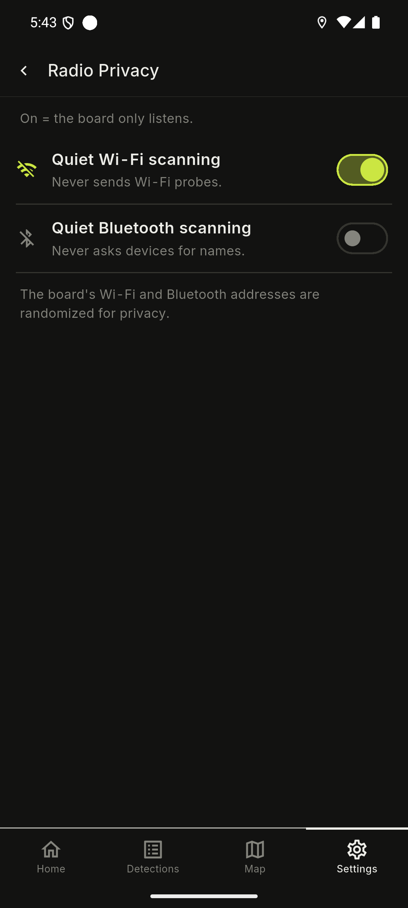</p>
<ol>
  <li><b>Quiet Wi-Fi scanning</b> (on by default): never sends Wi-Fi probes.</li>
  <li><b>Quiet Bluetooth scanning</b> (off by default): never asks devices for names.</li>
</ol>

## Internet services

The app has no analytics or crash reporting. It connects to a service below only when you use its feature. Detections, sessions and captures stay on the phone until you upload or export them.

| Service | When the app connects | What it sends | Usage rules the app follows |
|---|---|---|---|
| **Home dashboard** on your computer | You turn on **Home dashboard** (Settings → Data → Export) | Plain HTTP requests to the address you set, every 10 s while that screen is open. Carries the access token if you saved one. | UA `OUI-APEX-app`. No address, no requests. With **Find on this network** on, also one multicast DNS question for `_ouispy._tcp`. |
| [WiGLE](https://api.wigle.net) | Sign in or upload a session | API name + token; session file on upload | On HTTP 429, pauses WiGLE 24h. Each session uploads once, on confirm. |
| [WDGWars](https://wdgwars.pl) | Link an account, upload a session, or turn on **WDG territory** | API key; compressed session file; territory requests | UA `oui-spy-companion/1.0`. Retries an upload twice (2s, 8s) on dropped connection or server error. Honors the server's rate-limit wait. Territory refreshes at most every 5 min. |
| [Overpass API](https://wiki.openstreetmap.org/wiki/Overpass_API) (`overpass-api.de`, fallback `overpass.private.coffee`) | **Mapped ALPRs** on (off by default) and you move the map or open a Flock hit | The map corners in view | UA `oui-spy-companion/1.0`. Caches areas 7 days, one request at a time. On HTTP 429 waits 30s or longer. |
| [OpenFreeMap](https://openfreemap.org) styles: Dark (default), Fiord, Liberty, Bright, Positron | A map is on screen | Tile numbers in view | No account or key, no limit. Tiles cached 30 days (≤50 MB). Shows "OpenFreeMap © OpenMapTiles Data from OpenStreetMap". |
| [USGS The National Map](https://www.usgs.gov/faqs/what-are-terms-uselicensing-map-services-and-data-national-map): Satellite (US) | You pick Satellite (US) | Tile numbers in view | Public domain, no account. US only. Tiles cached 7 days (≤200 MB). Enlarges zoom-16 tiles past zoom 16. Shows USGS credit. |
| [GitHub](https://docs.github.com/en/rest/using-the-rest-api/rate-limits-for-the-rest-api) firmware | You tap **Check for Update** (Settings → Node → Firmware) | Nothing about you or your board | UA `oui-spy-companion/1.0`. 60 checks/hour per IP; pauses to GitHub's reset. Firmware comes from the same release. |
| [GitHub](https://github.com/lukeswitz/oui-spy-unified-blue/releases) releases | You tap **Check for update** or turn on **Check at launch** (Settings → About) | Nothing about you or your phone | UA `oui-spy-companion/1.0`. Downloads `release.json` and its signature, and the app file only when you tap **Install** or **Save to Downloads**. Off by default; no background checks. |
| Signature sets: [Fieldwatch](https://github.com/OffGridPete/Fieldwatch), [Home Assistant](https://github.com/home-assistant/core), or a link you add | You turn a set on or tap **Update** (Settings → Detection & Alerts → Your Lists → Signature sets) | Nothing | UA `oui-spy-companion/1.0`. https only, 8 MB limit. No background checks. |
| [Wireshark](https://www.wireshark.org/download/automated/data/) | You tap **Check for Update** (Settings → Data → Export → **OUI database**) | Nothing | Downloads Wireshark's MAC vendor list (`manuf.gz`). Limited to once every 7 days. UA `oui-spy-companion/1.0`. |
| Assistant providers: [Anthropic](https://api.anthropic.com), [OpenAI](https://api.openai.com), [Google](https://generativelanguage.googleapis.com), or your own Ollama server | **Assistant** is on, you picked that provider and OK'd it, and you ask, look into a device, write a report or tap **Check** | Your question and what the model reads within the grants (device names and MACs, alerts and so on; positions only with Location); the API key in a header | No background requests. Keys stay in secure storage. Ollama requests go only to the address you set. |
| [FAA DroneZone](https://uasdoc.faa.gov) | You tap **FAA RemoteID Lookup** or **FAA lookup** on a drone | The drone's Remote ID serial | UA `oui-spy-companion/1.0`. Caches a registration 30 days. Retries only on HTTP 502, up to 3×. |

## Build

You only need this to build the firmware or the app yourself. The web flasher and the release downloads cover normal use.

```bash
pio run -e v3_app_controlled                 # node, XIAO ESP32-S3
pio run -e v3_app_controlled_tdongle_s3      # node, T-Dongle-S3
pio run -e v3_app_controlled_stickc_plus     # node, M5StickC PLUS (also _stickc, _stickc_plus2)
./build_c5.sh                                # node, XIAO ESP32-C5
OUISPY_C5_ENV=v3_app_controlled_tdongle_c5 ./build_c5.sh   # node, T-Dongle-C5
pio run -e v3_node_manager_s3                # manager, XIAO ESP32-S3 (also _s3_devkitc, _xiao_c3, _wroom)
OUISPY_C5_ENV=v3_node_manager_c5 ./build_c5.sh             # manager, XIAO ESP32-C5
```

C5 builds use the pioarduino platform in a separate core dir (`~/.platformio-c5`) via `build_c5.sh`.

```bash
cd companion && flutter pub get && flutter build apk --release   # or ipa / macos
```

Over-the-air updates must be signed with the release key. A board flashed over USB takes any image.

## Credits

> Runs the [OUI-SPY ecosystem](https://github.com/colonelpanichacks) by colonelpanichacks with additional features.
>
> **Not affiliated with OUI-SPY.**

### Code and techniques

- Upstream engines: [Detector](https://github.com/colonelpanichacks/ouispy-detector), [Foxhunter](https://github.com/colonelpanichacks/ouispy-foxhunter), [Flock You](https://github.com/colonelpanichacks/flock-you), [Sky-Spy](https://github.com/colonelpanichacks/Sky-Spy), [UniPwn](https://github.com/colonelpanichacks/Oui-Spy-UniPwn) by **colonelpanichacks**.
- **colonelpanichacks** (Colonel Panic, MIT): `tools/home-dashboard/` is adapted from the `home-dashboard` folder of [ouispy-detector](https://github.com/colonelpanichacks/ouispy-detector). Details in [companion/NOTICE](companion/NOTICE).
- **Meshtastic** ([protobufs](https://github.com/meshtastic/protobufs), GPL-3.0): the Meshtastic radio link uses the Bluetooth UUIDs and message field numbers from the Meshtastic protocol. No Meshtastic code is included. Details in [companion/NOTICE](companion/NOTICE).
- **colonelpanichacks** ([OUI SPY Unified Blue](https://github.com/colonelpanichacks/oui-spy-unified-blue), MIT): the AXEOFF and BLE Sniff engines port its Axon signatures, advert filter bits and link-layer frame layout. Details in [companion/NOTICE](companion/NOTICE).
- **Will Greenberg** ([flock-you](https://github.com/wgreenberg/flock-you)): XUNTONG `0x09C8` detection.
- **@NitekryDPaul / OrdoOuroborous** ([@nitekry](https://github.com/nitekry)): promiscuous Flock OUI set and the addr1 receiver technique.
- **DeFlockJoplin** ([flock-you](https://github.com/DeflockJoplin/flock-you)): wildcard-probe signature.
- **OffGridPete** ([Fieldwatch](https://github.com/OffGridPete/Fieldwatch), MIT): the app's signature catalog starts from Fieldwatch catalog 92. The advertisement decoder, device explanations, signature engine, field decoder, pairing-flood and co-travel code are Dart ports of Fieldwatch. Details in [companion/NOTICE](companion/NOTICE).
- **Twotoz** ([C5VRX](https://github.com/Twotoz/C5VRX), GPL-3.0): the FPV receiver uses its published technique for tuning the C5 and reading the receiver data. We wrote our own code. Details in [companion/NOTICE](companion/NOTICE).

### Data and libraries

- Catalog entries from [Home Assistant](https://github.com/home-assistant/core) Bluetooth matchers, the [buttplug.io](https://github.com/buttplugio/buttplug) device config, and [Theengs Decoder](https://github.com/theengs/decoder) device identifiers.
- Fast Pair model names: the [WhisperPair](https://github.com/KULeuven-COSIC/WhisperPair) model list by KU Leuven COSIC (CC BY 4.0).
- Company and service IDs: [Bluetooth SIG assigned numbers](https://bitbucket.org/bluetooth-SIG/public).
- OUI sources: [zmattmanz](https://github.com/zmattmanz), [dougborg/AirHound](https://github.com/dougborg), [VirtuallyScott](https://github.com/VirtuallyScott).
- Vendor OUIs: IEEE MA-L, MA-M and MA-S registries via [Wireshark manuf](https://www.wireshark.org/download/automated/data/manuf.gz).
- Firmware libraries: [NimBLE-Arduino](https://github.com/h2zero/NimBLE-Arduino), [TinyGPS++](https://github.com/mikalhart/TinyGPSPlus), [Adafruit GFX](https://github.com/adafruit/Adafruit-GFX-Library); ESP-IDF ESP-NOW and mbedTLS.
- Map tiles: [OpenFreeMap](https://openfreemap.org/) with [OpenMapTiles](https://openmaptiles.org/) and [OpenStreetMap](https://www.openstreetmap.org/copyright) data; satellite imagery from [USGS The National Map](https://www.usgs.gov/programs/national-geospatial-program/national-map).

## Disclaimer

OUI-APEX is for security research, privacy auditing and education only. By using it, you agree to the following.

- **Your risk:** you use it at your own risk, and you alone are responsible for how you use it.
- **No warranty:** the firmware, the app and the flasher are provided "as is", without warranty of any kind. See [LICENSE](LICENSE).
- **No liability:** the authors and contributors are not liable for any damage or loss from their use, including a board that no longer boots after a flash.
- **Follow the law:** laws on radio monitoring, recording and tracking differ by country and state. Check yours before you scan. Don't use it to track people without their consent, or to get into networks or devices you don't own.
